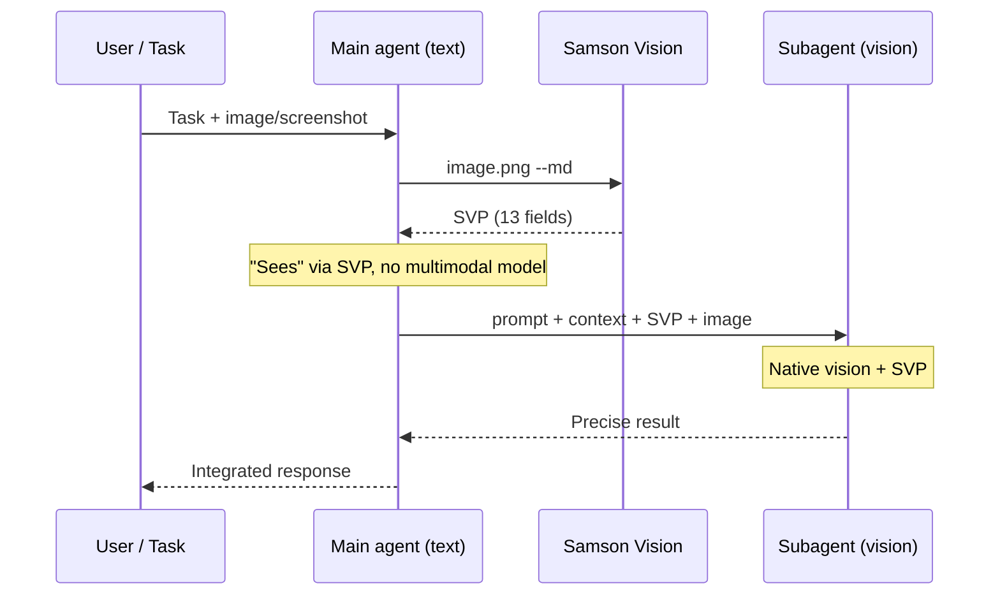

<p align="center">
  
</p>

<h1 align="center">Samson Vision</h1>

<p align="center">
  <strong>Tus limitaciones no son un límite imposible de superar.</strong><br>
  <em>Filipenses 4:13</em><br>
  <sub><strong>Your limitations are not an impossible limit to overcome.</strong><br>
  <em>Philippians 4:13</em></sub>
</p>

<p align="center">
  <em>Samson Vision da visión a tu agente aunque el modelo siga sin ojos — SVP extrae la verdad estructural bajo los píxeles.</em><br>
  <sub><em>Samson Vision gives your agent sight even when the model still has no eyes — SVP extracts structural truth beneath the pixels.</em></sub>
</p>

<p align="center">
  <a href="docs/SETUP.md"><strong>Install</strong></a>
  &nbsp;·&nbsp;
  <a href="../index.html"><strong>Landing</strong></a>
  &nbsp;·&nbsp;
  <a href="docs/SAMSON_VISION_PACK.md"><strong>SVP Spec</strong></a>
</p>


Samson Vision translates images into a **SAMSON_VISION_PACK (SVP)** — a 13-field structured text format that any text-only LLM can interpret. This allows models without native vision capabilities (DeepSeek, GPT-4o-mini, Llama, etc.) to understand visual content with high fidelity.

Samson lost his **physical sight** but regained the **vision of God's plan** (Judges 16:28-30). He did not need to see the temple — he needed to know **when and how to act**.

**Samson Vision** — *your limitations are not an impossible limit to overcome* (Philippians 4:13). Your agent **still has no eyes** — the same model, no vision — but receives **sight** through SVP: the structural truth pixels hide and a blind LLM cannot capture alone.

*Sansón perdió la vista física, pero recuperó la visión del plan de Dios. Samson Vision da visión a agentes ciegos a través del SVP — la verdad estructural que los píxeles esconden.*

## Subagent workflow

A **vision-less main agent** (e.g. **DeepSeek Flash v4 Pro** — text-only, cheap) orchestrates the task. **Samson Vision** complements the main agent: it converts the image into a **SAMSON_VISION_PACK (SVP)** (`--md`) so the main agent gains textual "sight" without being multimodal. Then it delegates to a **subagent with built-in vision** (native vision model) with prompt + context + embedded SVP.

**Steps:**

1. The **main agent** (no vision, e.g. DeepSeek Flash v4) receives a task with an image or screenshot.
2. **Samson Vision** generates the SVP (`python3 src/samson_vision.py image.png --md`) — the main agent gains textual "sight".
3. The main agent **delegates to the subagent** (WITH built-in vision): prompt + context + SVP.
4. The **subagent** uses its native vision **plus** the SVP for precise execution.
5. The **result returns to the main agent** — cheap orchestration, no expensive vision model in the main loop.



---

Un **agente principal sin visión** (p. ej. **DeepSeek Flash v4 Pro** — modelo texto-only, barato) orquesta la tarea. **Samson Vision** complementa al principal: convierte la imagen en **SAMSON_VISION_PACK (SVP)** (`--md`) para que el principal obtenga "visión" en texto sin ser multimodal. Luego delega al **subagente con visión incorporada** (modelo vision nativo) con prompt + contexto + SVP embebido.

**Pasos:**

1. El **agente principal** (sin visión, ej. DeepSeek Flash v4) recibe una tarea con imagen o screenshot.
2. **Samson Vision** genera el SVP (`python3 src/samson_vision.py imagen.png --md`) — el principal obtiene "visión" en texto.
3. El agente principal **delega al subagente** (CON visión incorporada): prompt + contexto + SVP.
4. El **subagente** usa su visión nativa **más** el SVP para ejecutar con precisión.
5. El **resultado vuelve al agente principal** — orquestación barata, sin modelo vision caro en el loop principal.


## How it works

```
Image → [Samson Core] → SAMSON_VISION_PACK (text) → [Any LLM] → Understanding
           ↑                    ↑                            ↑
      0% AI, all        13 fields of                   The model "sees"
      numpy/OpenCV      structured text                through the text
```

## The SAMSON_VISION_PACK (SVP)

The SVP is the core of Samson Vision — a multi-layer textual representation with 13 mandatory fields:

```
[SAMSON_VISION_PACK v1]

IMAGE_TYPE:           Type, domain, dimensions, aspect ratio
GLOBAL_SUMMARY:       One-line visual summary
VISUAL_HIERARCHY:     Elements ordered by importance with coordinates
LAYOUT_MAP:           Spatial zones with normalized coordinates (0-100)
OCR_TEXT:             Detected text with confidence scores
OBJECTS_AND_COMPONENTS: Detected objects/components
COLOR_MAP:            Color palette with human-readable names
DENSITY_MAP:          Content density by horizontal bands
ASCII_REPRESENTATION: Multi-style ASCII art (8 styles available)
USER_ACTIONS:         Interactive element coordinates
UNCERTAINTIES:        Explicit limitations of the detection
DO_NOT_ASSUME:        Anti-hallucination guardrails
FINAL_INTERPRETATION: Synthesis for text-only AI consumption
```

Each field serves a specific purpose: spatial awareness (LAYOUT_MAP, VISUAL_HIERARCHY), text extraction (OCR_TEXT), visual texture (ASCII_REPRESENTATION), color understanding (COLOR_MAP), and anti-hallucination (UNCERTAINTIES, DO_NOT_ASSUME).

## Quick start

```bash
# 1. Generate an SVP from any image
python3 src/samson_vision.py image.png --md > pack.md

# 2. Feed it to any text-only model
# (examples depend on your provider — see docs/SETUP.md)

# 3. The model interprets it as if it were seeing the image
```

## Key features

- **8 ASCII styles**: standard, detail, block, edge, color, dither, fanart, braille
- **Real OCR**: Tesseract with image preprocessing (2x upscale, OTSU binarization, line grouping)
- **Scene graph**: Object detection + spatial relationships via OpenCV
- **Device simulation**: 13 device profiles for responsive design testing
- **Audio visualization**: Convert audio to ASCII waveforms, spectrums, and beat patterns
- **Zero vision API calls**: The system itself uses no AI — it is purely algorithmic (numpy + OpenCV + Tesseract)

## Model compatibility

Samson SVP has been tested with **24+ models** across multiple providers. Most text-only LLMs can interpret the SVP effectively. See [BENCHMARK.md](docs/BENCHMARK.md) for detailed comparison.

## Benchmark summary

| Tier | Models | Quality | Speed |
|------|--------|:-------:|:-----:|
| 🥇 Best | MiniMax-M2.1, kimi-k2.7-code | 100% | 5-8s |
| 🥈 Great value | minimax-m2.5, qwen3.5-plus | 67-83% | 11-43s |
| 🥉 Solid | GPT-5.4-mini, MiniMax-M3 | 67-100% | 8-27s |
| ❌ Incompatible | deepseek-v4-flash/pro, glm-5.x | 0% | — |

## Architecture

```
samson-vision/
├── src/
│   ├── samson_core.py          ← ASCII conversion engine (8 styles)
│   ├── vmk/                    ← Vision Multimodal Kernel
│   │   ├── scene_graph.py      ← Bounding boxes, spatial relations
│   │   └── kernel.py           ← Color, edges, saliency, object detection
│   ├── samson_vision.py        ← SAMSON_VISION_PACK generator (the language)
│   ├── device_db.py            ← Device profiles for responsive testing
│   ├── synesthesia.py          ← Audio → ASCII visualization
│   └── harnesses.py            ← Model integration connectors
├── test/run_tests.py           ← 29 tests — 100% pass rate
└── docs/
    ├── ARCHITECTURE.md         ← Detailed architecture
    ├── SAMSON_VISION_PACK.md   ← Complete SVP specification
    ├── BENCHMARK.md            ← Model comparison
    ├── COSTS.md                ← Usage costs
    └── SETUP.md                ← Installation guide
```

## When to use Samson Vision vs direct vision models

| Scenario | Use | Why |
|----------|-----|-----|
| Target model has **no vision** | **Samson SVP** | Only way for text-only models to "see" |
| **Cost-sensitive** at scale | **Samson SVP** | 50-100x cheaper than vision API calls |
| Need **maximum fidelity** (photos, logos) | **Direct vision model** | Native vision sees non-textual elements |
| **Text-heavy** content (docs, web, dashboards) | **Samson SVP** | Near-indistinguishable from direct vision |
| **Agent continuity** — keep same model/skills | **Samson SVP** | Project vision survives model switches |

## License

MIT
