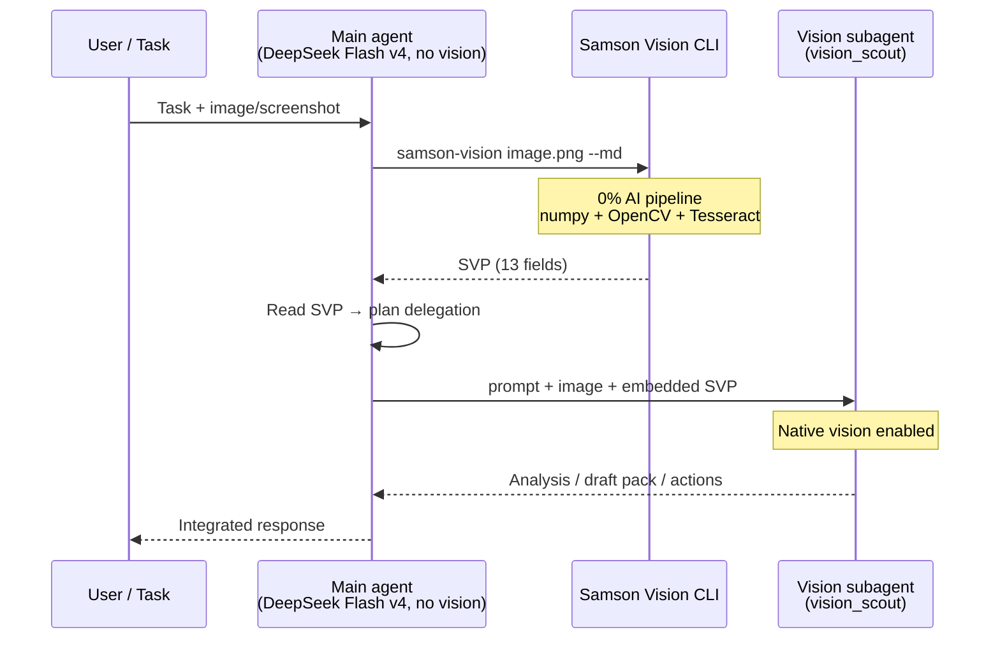

<p align="center">
  
</p>

<h1 align="center">Samson Vision</h1>

<p align="center">
  <em>ES:</em> Tus limitaciones no son un límite imposible de superar. <em>Filipenses 4:13</em>
</p>
<p align="center">
  <em>EN:</em> Your limitations are not an impossible limit to overcome. <em>Philippians 4:13</em>
</p>
<p align="center">
  Tu agente sigue sin ojos — el mismo modelo, sin visión — pero recibe visión a través del SVP.
</p>
<p align="center">
  <em>Your agent still has no eyes — same model, no vision — but receives sight through SVP.</em>
</p>


<p align="center">
  <a href="docs/SETUP.md"><strong>Install</strong></a>
  &nbsp;·&nbsp;
  <a href="../index.html"><strong>Landing</strong></a>
  &nbsp;·&nbsp;
  <a href="docs/SAMSON_VISION_PACK.md"><strong>SVP Spec</strong></a>
</p>


Samson Vision translates images into a **SAMSON_VISION_PACK (SVP)** — a 13-field structured text format that any text-only LLM can interpret. This allows models without native vision capabilities (DeepSeek, GPT-4o-mini, Llama, etc.) to understand visual content with high fidelity.

## Subagent workflow

Real orchestration flow (see `runtime/NOUS_AGENT_BLUEPRINT.md` and `runtime/subagents/` contracts). Jordan operational details pending confirmation on claw.

| Role | Typical model | Native vision | Function |
|------|---------------|:-------------:|----------|
| **Main agent** (orchestrator) | **DeepSeek Flash v4** | ❌ No | Coordinates, reads SVP, delegates, synthesizes |
| **Vision subagent** | vision_scout / multimodal | ✅ Yes | Analyzes image, refines or validates pack |
| **Samson Vision CLI** | Algorithmic pipeline | — | Generates SVP (0% AI, numpy+OpenCV+Tesseract) |

**Who runs the CLI and when:** the **main agent or its harness** (Jordan/Hermes, Cursor orchestrator) runs `samson-vision image.png --md` **before delegating** whenever the task includes an image or screenshot. The vision subagent does **not** replace the CLI — it also receives the native image.

**SVP role in delegation:**
1. The **visionless orchestrator** reads SVP as structured text (13 fields) to understand the scene.
2. Embeds SVP in the delegation prompt together with the image path/file.
3. The **vision subagent** works with image + SVP context (layout, OCR, coordinates).
4. Result returns to DeepSeek Flash v4 orchestrator for synthesis or delivery.

> **Benchmark note:** DeepSeek Flash v4 as **orchestrator** reads SVP in context. As **SVP interpreter via API** (text_reasoner mode) returns empty — use MiniMax/kimi for LLM pack interpretation.



**Steps:**

1. **Main agent** (DeepSeek Flash v4, no vision) receives task with image.
2. **Before delegating**, runs Samson Vision CLI → SVP.
3. Reads SVP to orient (layout, OCR, hierarchy) without vision API.
4. **Delegates to vision subagent**: prompt + image + SVP in context.
5. Subagent (`vision_scout` in `runtime/subagents/`) analyzes with native vision.
6. **Result returns to orchestrator** for validation or delivery.

*Main agent runs Samson CLI first, reads SVP, delegates to vision-capable subagent with image + embedded SVP.*


## How it works

```
Image → [Samson Core] → SAMSON_VISION_PACK (text) → [Any LLM] → Understanding
           ↑                    ↑                            ↑
      0% AI, all        13 fields of                   The model "sees"
      numpy/OpenCV      structured text                through the text
```

## The SAMSON_VISION_PACK (SVP)

The SVP is the core of Samson Vision — a multi-layer textual representation with 13 mandatory fields:

```
[SAMSON_VISION_PACK v1]

IMAGE_TYPE:           Type, domain, dimensions, aspect ratio
GLOBAL_SUMMARY:       One-line visual summary
VISUAL_HIERARCHY:     Elements ordered by importance with coordinates
LAYOUT_MAP:           Spatial zones with normalized coordinates (0-100)
OCR_TEXT:             Detected text with confidence scores
OBJECTS_AND_COMPONENTS: Detected objects/components
COLOR_MAP:            Color palette with human-readable names
DENSITY_MAP:          Content density by horizontal bands
ASCII_REPRESENTATION: Multi-style ASCII art (8 styles available)
USER_ACTIONS:         Interactive element coordinates
UNCERTAINTIES:        Explicit limitations of the detection
DO_NOT_ASSUME:        Anti-hallucination guardrails
FINAL_INTERPRETATION: Synthesis for text-only AI consumption
```

Each field serves a specific purpose: spatial awareness (LAYOUT_MAP, VISUAL_HIERARCHY), text extraction (OCR_TEXT), visual texture (ASCII_REPRESENTATION), color understanding (COLOR_MAP), and anti-hallucination (UNCERTAINTIES, DO_NOT_ASSUME).

## Quick start

```bash
# 1. Generate an SVP from any image
python3 src/samson_vision.py image.png --md > pack.md

# 2. Feed it to any text-only model
# (examples depend on your provider — see docs/SETUP.md)

# 3. The model interprets it as if it were seeing the image
```

## Key features

- **8 ASCII styles**: standard, detail, block, edge, color, dither, fanart, braille
- **Real OCR**: Tesseract with image preprocessing (2x upscale, OTSU binarization, line grouping)
- **Scene graph**: Object detection + spatial relationships via OpenCV
- **Device simulation**: 13 device profiles for responsive design testing
- **Audio visualization**: Convert audio to ASCII waveforms, spectrums, and beat patterns
- **Zero vision API calls**: The system itself uses no AI — it is purely algorithmic (numpy + OpenCV + Tesseract)

## Model compatibility

Samson SVP has been tested with **24+ models** across multiple providers. Most text-only LLMs can interpret the SVP effectively. See [BENCHMARK.md](docs/BENCHMARK.md) for detailed comparison.

## Benchmark summary

| Tier | Models | Quality | Speed |
|------|--------|:-------:|:-----:|
| 🥇 Best | MiniMax-M2.1, kimi-k2.7-code | 100% | 5-8s |
| 🥈 Great value | minimax-m2.5, qwen3.5-plus | 67-83% | 11-43s |
| 🥉 Solid | GPT-5.4-mini, MiniMax-M3 | 67-100% | 8-27s |
| ❌ Incompatible | deepseek flash v4, glm-5.x | 0% | — |

## Architecture

```
samson-vision/
├── src/
│   ├── samson_core.py          ← ASCII conversion engine (8 styles)
│   ├── vmk/                    ← Vision Multimodal Kernel
│   │   ├── scene_graph.py      ← Bounding boxes, spatial relations
│   │   └── kernel.py           ← Color, edges, saliency, object detection
│   ├── samson_vision.py        ← SAMSON_VISION_PACK generator (the language)
│   ├── device_db.py            ← Device profiles for responsive testing
│   ├── synesthesia.py          ← Audio → ASCII visualization
│   └── harnesses.py            ← Model integration connectors
├── test/run_tests.py           ← 29 tests — 100% pass rate
└── docs/
    ├── ARCHITECTURE.md         ← Detailed architecture
    ├── SAMSON_VISION_PACK.md   ← Complete SVP specification
    ├── BENCHMARK.md            ← Model comparison
    ├── COSTS.md                ← Usage costs
    └── SETUP.md                ← Installation guide
```

## When to use Samson Vision vs direct vision models

| Scenario | Use | Why |
|----------|-----|-----|
| Target model has **no vision** | **Samson SVP** | Only way for text-only models to "see" |
| **Cost-sensitive** at scale | **Samson SVP** | 50-100x cheaper than vision API calls |
| Need **maximum fidelity** (photos, logos) | **Direct vision model** | Native vision sees non-textual elements |
| **Text-heavy** content (docs, web, dashboards) | **Samson SVP** | Near-indistinguishable from direct vision |
| **Agent continuity** — keep same model/skills | **Samson SVP** | Project vision survives model switches |

## License

MIT
