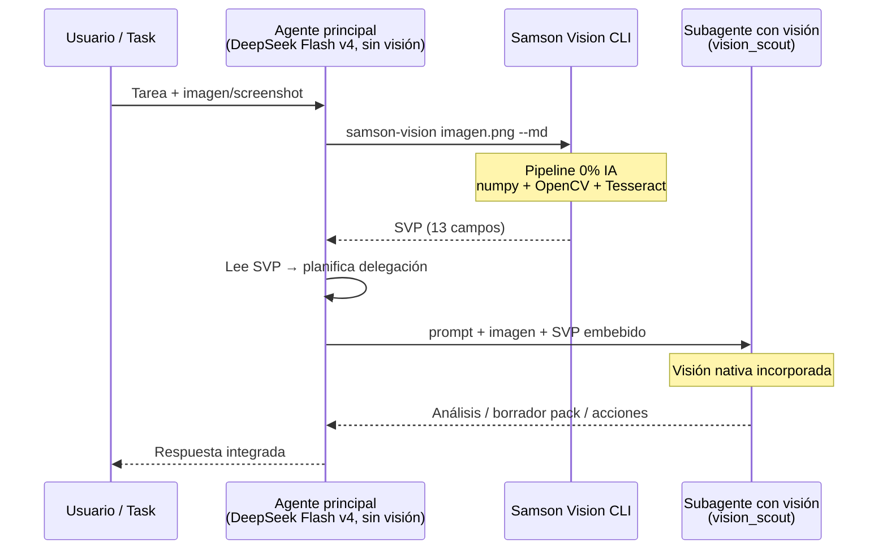

<p align="center">
  
</p>

<h1 align="center">Samson Vision</h1>

<p align="center">
  Convierte imágenes en texto estructurado para que modelos sin visión razonen sobre capturas, documentos y pantallas.<br>
  <em>Turns images into structured text so text-only models can reason over screenshots, documents, and screens.</em>
</p>
<p align="center">
  No reemplaza completamente un modelo de visión. Puente barato, auditable y versionable.<br>
  <em>Does not fully replace a vision model. A cheap, auditable, versionable bridge.</em>
</p>

<p align="center">
  <em>ES:</em> Tus limitaciones no son un límite imposible de superar. <em>Filipenses 4:13</em><br>
  <em>EN:</em> Your limitations are not an impossible limit to overcome. <em>Philippians 4:13</em>
</p>

<p align="center">
  <a href="PUBLIC/docs/SETUP.md"><strong>Instalar</strong></a>
  &nbsp;·&nbsp;
  <a href="#uso-rápido"><strong>Inicio rápido</strong></a>
  &nbsp;·&nbsp;
  <a href="index.html"><strong>Landing</strong></a>
  &nbsp;·&nbsp;
  <a href="PUBLIC/docs/SAMSON_VISION_PACK.md"><strong>SVP</strong></a>
</p>

## Cuándo usarlo / When to use

| ✅ Usar SVP | ❌ No usar solo SVP |
|-------------|---------------------|
| Screenshots, dashboards, formularios / forms | Detalle fino en fotos / fine photo detail |
| OCR + layout, UI, documentos escaneados | Reconocimiento facial / facial recognition |
| Agentes baratos sin visión nativa / cheap text-only agents | Decisiones médicas o legales críticas / critical medical/legal |
| CI/QA con diff versionable de capturas | Fidelidad pixel-perfect de logos o iconos |
| Orquestadores que delegan a subagentes con visión | Cuando la fidelidad visual supera el coste / fidelity > cost |

> Samson Vision es un puente visual-textual: no le da ojos reales a una IA, pero le entrega descripción estructurada, auditable y barata para que un LLM pueda razonar sobre la traducción textual — no para que "vea" como un modelo multimodal nativo.
>
> *Samson Vision is a visual-text bridge: it does not give an AI real eyes, but delivers structured, auditable, cheap description so an LLM can reason over the textual translation — not "see" like a native multimodal model.*

---

## Metáfora

Sansón pudo ver aun sin ojos — su visión era el plan de Dios, no la retina. Samson Vision ofrece **visión operativa para IA sin ojos**: el agente sigue siendo el mismo modelo de texto, pero recibe contexto visual a través del SVP antes de actuar o delegar.

*Samson could see even without eyes — his vision was God's plan, not his retina. Samson Vision offers **operational sight for eyeless AI**: the agent stays the same text model, but receives visual context through SVP before acting or delegating.*

**El problema:** Los agentes limitados por APIs de visión pierden errores estructurales, cambiar de modelo borra el contexto, y los modelos multimodales cuestan más mientras sacrifican profundidad en código y razonamiento.

**La respuesta (metáfora):** Recuperar la **visión del proyecto** sin cambiar de modelo ni pagar visión nativa en todo el stack.

---

## Técnica real

Samson Vision **no convierte una IA de texto en un modelo de visión**. Le entrega una **traducción estructurada** de la imagen — el **SAMSON_VISION_PACK (SVP)** — con 13 capas de información:

| Capa | Campo SVP | Qué aporta |
|------|-----------|------------|
| OCR | `OCR_TEXT` | Texto detectado con Tesseract (ES+EN) |
| Coordenadas | `LAYOUT_MAP`, `VISUAL_HIERARCHY`, `USER_ACTIONS` | Zonas y elementos con coords normalizadas |
| ASCII | `ASCII_REPRESENTATION` | 8 estilos de mapa textual |
| Colores | `COLOR_MAP` | Paleta con nombres legibles |
| Densidad | `DENSITY_MAP` | Bandas horizontales de contenido |
| Jerarquía | `VISUAL_HIERARCHY` | Orden de importancia visual |
| Regiones | `OBJECTS_AND_COMPONENTS` | Detección de regiones visuales (OpenCV), no object detection ML |
| Anti-alucinación | `UNCERTAINTIES`, `DO_NOT_ASSUME` | Límites explícitos del pipeline |

Pipeline **0% IA** en la generación: numpy + OpenCV + Tesseract. Un **LLM compatible puede razonar sobre la traducción textual** del SVP — no todos los modelos lo interpretan bien (ver benchmark).

*Samson Vision does **not** turn a text AI into a vision model. It delivers a **structured translation** — the 13-field SVP — so a **compatible LLM can reason over the textual translation**.*

---

## Modos de uso A / B / C

| Modo | Descripción | Cuándo |
|------|-------------|--------|
| **A — SVP + LLM texto** | Solo pipeline SVP + modelo sin visión nativa | Agente barato, OCR/layout, CI diff, orquestador sin multimodal |
| **B — SVP orienta + subagente valida** | Orquestador sin visión lee SVP → delega a subagente **con** visión nativa (flujo Jordan/Hermes actual) | UI review, accesibilidad, regresiones — lo mejor de ambos mundos |
| **C — Visión directa** | Modelo multimodal nativo sobre la imagen | Fidelidad > coste: fotos, logos, detalle fino no capturado por OCR |

> **Modo B** es el flujo recomendado en producción: el orquestador barato **ve en texto** antes de delegar; el subagente con visión **valida y ejecuta** sobre la imagen real.

---

## Flujo Modo B — subagentes / Subagent workflow

Flujo real de orquestación (validado en `runtime/NOUS_AGENT_BLUEPRINT.md` y contratos en `runtime/subagents/`).

| Rol | Modelo típico | Visión nativa | Función |
|-----|---------------|:-------------:|---------|
| **Agente principal** (orquestador) | **DeepSeek Flash v4** | ❌ No | Coordina, lee SVP, delega, sintetiza |
| **Subagente de visión** | vision_scout / multimodal | ✅ Sí | Analiza la imagen, refina o valida el pack |
| **Samson Vision CLI** | Pipeline algorítmico | — | Genera SVP (0% IA, numpy+OpenCV+Tesseract) |

**Quién ejecuta el CLI:** el **agente principal o su harness** invoca `samson-vision imagen.png --md` **antes de delegar**. El subagente recibe imagen + SVP embebido.

> **Nota benchmark:** DeepSeek Flash v4 como **orquestador** lee SVP en contexto. Como **intérprete SVP vía API** (modo text_reasoner) devuelve vacío — usar MiniMax/kimi para interpretación LLM del pack.



---

## Limitaciones honestas / Honest limitations

### Funciona bien / Works well
- Screenshots de UI, dashboards, formularios web
- Documentos con texto legible (OCR + layout)
- CI/QA con diff versionable de SVPs
- Orquestadores baratos que delegan validación visual

### Funciona regular / Works adequately
- Imágenes con poco contraste o fuentes pequeñas
- Diagramas complejos sin texto embebido
- Contenido muy denso donde OCR pierde líneas

### No usar solo SVP / Do not rely on SVP alone
- Fotografía artística o detalle fino de texturas
- Reconocimiento facial o identidad visual
- Decisiones médicas, legales o de seguridad crítica
- Logos/iconos donde importa fidelidad pixel-perfect → **Modo C**

---

## Casos de uso / Use cases

Patrón común (**Modo B**): orquestador sin visión + SVP + subagente con visión incorporada.

- **Orquestador barato revisa screenshot de UI** · *Cheap orchestrator reviews UI screenshot*
- **CI/CD sin modelo de visión en orquestador** · *CI/CD without vision on orchestrator*
- **Subagente Cursor con visión** · *Cursor vision subagent*
- **Auditoría de accesibilidad** · *Accessibility audit*
- **Portfolio y evidencia de producción** · *Portfolio / production evidence*

---

## Stack 80/20 — Modelo más rápido + fallback

```
SVP → MiniMax-M2.1 (mmx CLI)  → 5s, $0.0008/query, 6/6 señales El Mundo  ← 🏆 PRIMARIO
SVP → minimax-m2.5 (OpenCode) → 11s, $0.0009/query, 5/6 señales           ← 🔄 FALLBACK
SVP → kimi-k2.7-code (OpenCode) → 8s, $0.003/query, 6/6 señales           ← 🎯 PRECISIÓN
```

## Benchmark — 24 modelos testeados

Métrica: **6 señales binarias** en captura test El Mundo (1280×800) — no "calidad visual completa". Ver [`PUBLIC/docs/BENCHMARK.md`](PUBLIC/docs/BENCHMARK.md).

| # | Modelo | Via | Señales 6/6 | Tiempo | Coste/query |
|---|--------|-----|:-----------:|:------:|:-----------:|
| 1 | **MiniMax-M2.1** 🏆 | mmx CLI | ✅ 6/6 | **5s** | $0.0008 |
| 2 | **kimi-k2.7-code** | OpenCode | ✅ 6/6 | 8s | $0.0030 |
| 3 | gpt-5.4-mini | Codex | ✅ 6/6 | 8s | subscription |
| 4 | **minimax-m2.5** 🥈 | OpenCode | 5/6 | 11s | **$0.0009** |
| 5 | MiniMax-M3 | OpenCode | 4/6 | 10s | $0.0009 |
| ❌ | deepseek flash v4 | OpenCode | 0/6 | — | vacío |
| ❌ | glm-5.x | OpenCode | 0/6 | — | vacío |

## El Lenguaje: SAMSON_VISION_PACK (SVP)

```
[SAMSON_VISION_PACK v1]

IMAGE_TYPE / GLOBAL_SUMMARY / VISUAL_HIERARCHY / LAYOUT_MAP
OCR_TEXT / OBJECTS_AND_COMPONENTS / COLOR_MAP / DENSITY_MAP
ASCII_REPRESENTATION / USER_ACTIONS / UNCERTAINTIES / DO_NOT_ASSUME
FINAL_INTERPRETATION
```

## Componentes

```
samson-vision/
├── src/
│   ├── samson_core.py         ← 8 estilos ASCII
│   ├── vmk/                   ← Vision Multimodal Kernel (OpenCV)
│   │   ├── scene_graph.py     ← BBox, relaciones espaciales
│   │   └── kernel.py          ← color, bordes, saliency, detección de regiones
│   ├── samson_vision.py       ← SVP generator + generate_svp() API
│   ├── device_db.py           ← 13 perfiles responsive
│   ├── synesthesia.py         ← audio → ASCII
│   └── harnesses.py           ← integración con modelos externos
├── test/run_tests.py          ← 29 unit tests básicos
└── examples/                  ← ejemplos planificados (stub)
```

## Uso rápido

```bash
# Generar SVP (CLI)
samson-vision imagen.png --md > pack.md

# Generar SVP (API Python)
python3 -c "from samson_vision import generate_svp; print(generate_svp('imagen.png', fmt='md'))"

# Interpretar con MiniMax-M2.1
cat pack.md | mmx text chat --model MiniMax-M2.1 --message "$(cat pack.md)"
```

## Tests

```bash
python3 test/run_tests.py
# → 29/29 unit tests básicos
```

## Costes mensuales estimados

| Uso | Modelo | Coste |
|-----|--------|:-----:|
| 100 queries/día | MiniMax-M2.1 (mmx) | ~$2.40/mes |
| 100 queries/día | minimax-m2.5 (OpenCode) | ~$2.70/mes |
| 100 queries/día | kimi-k2.7-code (OpenCode) | ~$9.00/mes |

Ver [`PUBLIC/docs/COSTS.md`](PUBLIC/docs/COSTS.md).

## Publicar en GitHub

Documentación pública en [`PUBLIC/`](PUBLIC/) — sanitizada, sin rutas personales ni API keys.

## Licencia

MIT
