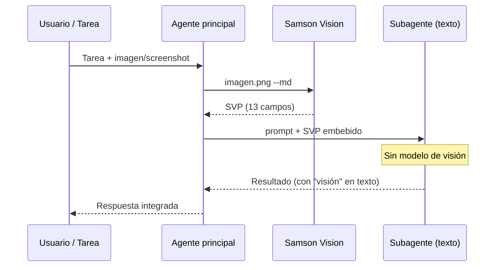

<p align="center">
  
</p>

<h1 align="center">Samson Vision</h1>

<p align="center">
  <em>Tus limitaciones no son un límite imposible de superar.</em> <sub>*Filipenses 4:13*</sub><br>
  <sub><em>Your limitations are not an impossible limit to overcome.</em> *Philippians 4:13*</sub><br>
  <sub>Tu agente sigue sin ojos — el mismo modelo, sin visión — pero recibe visión a través del SVP. · Your agent still has no eyes — same model, no vision — but receives sight through SVP.</sub>
</p>

<p align="center">
  <a href="PUBLIC/docs/SETUP.md"><strong>Instalar</strong></a>
  &nbsp;·&nbsp;
  <a href="#uso-rápido"><strong>Inicio rápido</strong></a>
  &nbsp;·&nbsp;
  <a href="index.html"><strong>Landing</strong></a>
  &nbsp;·&nbsp;
  <a href="PUBLIC/docs/SAMSON_VISION_PACK.md"><strong>SVP</strong></a>
</p>

Sansón pudo ver aun sin ojos. Tu agente recuperará la **visión del proyecto** aunque su modelo siga siendo el mismo — sin modelos con visión que encarecen y pierden habilidades.

**El problema:** Los agentes limitados por APIs de visión pierden errores estructurales, cambiar de modelo borra el contexto, y los modelos multimodales cuestan más mientras sacrifican profundidad en código y razonamiento.

**La respuesta:** El **SAMSON_VISION_PACK (SVP)** — 13 campos de texto estructurado que reemplazan la necesidad de enviar imágenes a LLMs costosos. Mismo modelo. Mismas habilidades. Comprensión visual completa a través de texto.

*This project is shared as a personal blessing — so teams are not forced into expensive vision models when text-only agents can see just as clearly through SVP.*


---

## ¿Qué es?

Samson Vision es un **lenguaje visual basado en texto** que permite a una IA sin visión "ver" imágenes. Traduce píxeles al **SAMSON_VISION_PACK (SVP)** — un formato estructurado con 13 campos — que cualquier modelo de texto puede interpretar como si estuviera viendo la imagen.

Sansón perdió la **vista física**, pero recuperó la **visión del plan de Dios** (Jueces 16:28-30). No necesitaba ver el templo — necesitaba saber **cuándo y cómo actuar**.

**Samson Vision** revela el plan oculto bajo los píxeles. Tu agente **sigue sin ojos** — el mismo modelo, sin visión — pero recibe **visión** a través del SVP: la verdad estructural que los píxeles esconden y que un LLM ciego no puede captar solo.

*Samson lost his physical sight but regained the vision of God's plan (Judges 16:28-30). He did not need to see the temple — he needed to know when and how to act. Samson Vision gives blind agents sight through SVP: structural truth that pixels hide and a sightless LLM cannot capture alone.*

## Flujo con subagentes / Subagent workflow

Un **agente principal** recibe tareas con imágenes o capturas de pantalla. Antes de delegar, el pipeline (o el agente principal) genera un **SAMSON_VISION_PACK (SVP)** con Samson Vision. El **subagente** — normalmente un modelo **solo texto**, sin visión — recibe el prompt de la tarea **más el SVP embebido** en su contexto.

Así se preserva la transferencia de contexto visual **sin** usar modelos de visión costosos en el subagente ni cambiar de modelo.



**Pasos:**

1. El **agente principal** recibe una tarea con imagen o screenshot.
2. **Samson Vision** genera el SVP (`python3 src/samson_vision.py imagen.png --md`).
3. El agente principal **delega al subagente**: prompt de la tarea + SVP embebido en el contexto.
4. El **subagente** (sin visión nativa) trabaja con la "visión" estructurada en texto.
5. El **resultado vuelve al agente principal** para síntesis, validación o entrega al usuario.

*The main agent receives image tasks, Samson Vision produces SVP text, and the text-only subagent works with embedded structured vision — preserving context without expensive vision models on the subagent.*


## Stack 80/20 — Modelo más rápido + fallback

```
SVP → MiniMax-M2.1 (mmx CLI)  → 5s, $0.0008/query, 100% calidad  ← 🏆 PRIMARIO
SVP → minimax-m2.5 (OpenCode) → 11s, $0.0009/query, 83% calidad   ← 🔄 FALLBACK
SVP → kimi-k2.7-code (OpenCode) → 8s, $0.003/query, 100% calidad   ← 🎯 PRECISIÓN
```

El flujo es automático: primero intenta M2.1 (5s). Si falla, cae a M2.5. Si necesitas máxima precisión, usa Kimi K2.7.

## Benchmark completo — 24 modelos testeados

Ver [`docs/COSTS.md`](docs/COSTS.md) para costes detallados.

| # | Modelo | Via | Calidad | Tiempo | Coste/query | Cobertura |
|---|--------|-----|:-----:|:------:|:----------:|:---------:|
| 1 | **MiniMax-M2.1** 🏆 | mmx CLI | 100% | **5s** | $0.0008 | ✅✅✅✅✅✅ |
| 2 | **kimi-k2.7-code** | OpenCode | 100% | 8s | $0.0030 | ✅✅✅✅✅✅ |
| 3 | gpt-5.4-mini | Codex | 100% | 8s | subscription (per-token) | ✅✅✅✅✅✅ |
| 4 | **minimax-m2.5** 🥈 | OpenCode | 83% | 11s | **$0.0009** | ✅✅✅✅✅❌ |
| 5 | MiniMax-M2.7-highspeed | mmx | 83% | 11s | $0.0016 | ✅✅✅✅✅❌ |
| 6 | minimax-m3 | OpenCode | 67% | 10s | $0.0009 | ✅✅✅❌❌✅ |
| 7 | mimo-v2-omni | OpenCode | 67% | 9s | $0.0029 | ✅✅✅❌❌✅ |
| 8 | qwen3.5-plus | OpenCode | 67% | 43s | $0.0012 | ✅✅✅❌❌❌ |
| ❌ | deepseek-v4-flash | OpenCode | 0% | — | $0.0003 | vacío (0%) |
| ❌ | glm-5.2/5.1/5 | OpenCode | 0% | — | $0.0039 | vacío (0%) |

## El Lenguaje: SAMSON_VISION_PACK (SVP)

El SVP es un formato de 13 campos que traduce cualquier imagen a texto estructurado:

```
[SAMSON_VISION_PACK v1]

IMAGE_TYPE:          tipo, dominio, dimensiones
GLOBAL_SUMMARY:      resumen visual
VISUAL_HIERARCHY:    importancia por coordenadas
LAYOUT_MAP:          zonas con coordenadas %
OCR_TEXT:            texto detectado (Tesseract real)
OBJECTS_AND_COMPONENTS: elementos detectados
COLOR_MAP:           paleta de colores
DENSITY_MAP:         densidad de contenido
ASCII_REPRESENTATION: mapa ASCII significativo
USER_ACTIONS:        puntos de interacción
UNCERTAINTIES:       limitaciones explícitas
DO_NOT_ASSUME:       antialucinación
FINAL_INTERPRETATION: síntesis para IA sin visión
```

Cada campo está diseñado para que un modelo de texto pueda reconstruir mentalmente la imagen con la máxima fidelidad posible.

## Componentes

```
samson-vision/
├── src/
│   ├── samson_core.py         ← 8 estilos ASCII + lenguaje visual
│   ├── vmk/                   ← Vision Multimodal Kernel (OpenCV)
│   │   ├── scene_graph.py     ← BBox, relaciones espaciales
│   │   └── kernel.py          ← color, bordes, saliency, objetos
│   ├── samson_vision.py       ← SAMSON_VISION_PACK v1 (el lenguaje)
│   ├── device_db.py           ← 13 dispositivos para testing responsive
│   ├── synesthesia.py         ← audio → visualización ASCII
│   └── harnesses.py           ← integración con modelos externos
├── test/run_tests.py          ← 29 tests — 100%
└── docs/
    └── COSTS.md               ← costes detallados por modelo

Skills: samson-vision (3 modos de uso documentados)
```

## Uso rápido

```bash
# Generar SVP de una imagen
cd ~/proyectos/samson-vision/src
python3 samson_vision.py imagen.png --md > vbp.md

# 🏆 Interpretar con MiniMax-M2.1 (más rápido)
cat vbp.md | mmx text chat --model MiniMax-M2.1 \
  --system "Eres Samson Vision..." --message "$(cat vbp.md)"

# 🥈 Interpretar con minimax-m2.5 via OpenCode (fallback barato)
curl -s https://opencode.ai/zen/go/v1/chat/completions \
  -H "Authorization: Bearer $KEY" \
  -d '{"model":"minimax-m2.5", "messages":[...]}'

# 🎯 Interpretar con Kimi K2.7 (máxima precisión)
curl -s https://opencode.ai/zen/go/v1/chat/completions \
  -H "Authorization: Bearer $KEY" \
  -d '{"model":"kimi-k2.7-code", "messages":[...], "max_tokens":1500}'

# 🎫 Interpretar con Codex (si tienes ChatGPT Plus)
codex -z "Eres Samson Vision. $(cat vbp.md)"
```

## Tests

```bash
python3 ~/proyectos/samson-vision/test/run_tests.py
# → 29/29 tests — 100%
```

## Modos de uso

| Modo | Cuándo | Coste |
|------|--------|-------|
| **Sistema puro** | Datos técnicos (color, brillo, bordes) | $0 |
| **SVP + modelo texto** | Cuando el modelo no ve imágenes | $0.0008-$0.003/query |
| **M3 directo (visión)** | Máxima fidelidad (ve fotos) | ~$0.003 |

## Costes mensuales estimados

| Uso | Modelo | Coste |
|-----|--------|:-----:|
| 100 queries/día | MiniMax-M2.1 (mmx) | ~$2.40/mes |
| 100 queries/día | minimax-m2.5 (OpenCode) | ~$2.70/mes |
| 100 queries/día | kimi-k2.7-code (OpenCode) | ~$9.00/mes |

Ver [`docs/COSTS.md`](docs/COSTS.md) para desglose completo de costes, proveedores y planes.

## Publicar en GitHub

La documentación pública (sin datos sensibles) está en [`PUBLIC/`](PUBLIC/):

```
PUBLIC/
├── README.md              ← Landing page (sanitized)
├── INDEX.md               ← Navigation hub
├── docs/
│   ├── ARCHITECTURE.md    ← Technical architecture
│   ├── SAMSON_VISION_PACK.md ← SVP spec (13 fields)
│   ├── BENCHMARK.md       ← Model comparison
│   ├── SETUP.md           ← Installation guide
│   └── COSTS.md           ← Usage costs
```

Contenido sanitizado: sin rutas personales (~/), sin API keys, sin detalles de cuentas,
sin nombres de usuario, sin configuraciones internas. Listo para copiar a un repo público.

## La metáfora de Sansón

> Sansón perdió la **vista física**, pero recuperó la **visión del plan de Dios** (Jueces 16:28-30).
>
> No necesitaba ver el templo — necesitaba saber **cuándo y cómo actuar**.
>
> **Samson Vision** revela el plan oculto bajo los píxeles. Tu agente **sigue sin ojos** — el mismo modelo, sin visión — pero recibe **visión** a través del SVP: la verdad estructural que los píxeles esconden y que un LLM ciego no puede captar solo.
>
> *The AI still has no eyes — no vision model — but Samson Vision gives it sight anyway through SVP text. It does not need to "see" pixels; SVP extracts structural truth the natural eye (or blind model) cannot capture.*
