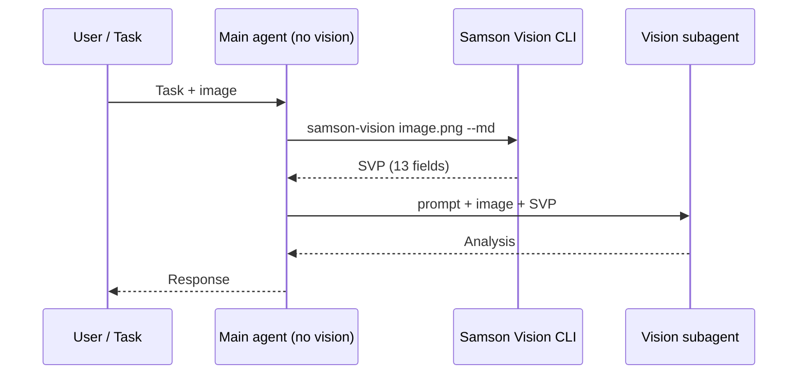

<p align="center">
  
</p>

# Samson Vision

Samson Vision is a **visual-to-text bridge for AI agents**. It converts screenshots, documents, and UI images into a structured text pack called **SVP** (SAMSON_VISION_PACK) — 13 fields of OCR, layout, ASCII, colors, and anti-hallucination guardrails — so text-only LLMs can reason about visual content without native vision APIs.

*Samson Vision es un **puente visual-textual para agentes de IA**. Convierte capturas, documentos e imágenes de interfaz en un paquete de texto estructurado llamado **SVP** — 13 capas de OCR, layout, ASCII, colores y límites explícitos — para que LLMs sin visión nativa razonen sobre contenido visual sin APIs multimodales.*

> **Vision Bridge** para agentes de código, QA visual, screenshots, dashboards, webs, Excel y errores de interfaz.
>
> *Vision bridge for coding agents, visual QA, screenshots, dashboards, web UIs, spreadsheets, and interface errors.*

**One-liner:** *Tu agente sigue sin ojos — el mismo modelo, sin visión — pero recibe visión operativa a través del SVP.* / *Your agent still has no eyes — same model, no vision — but receives operational sight through SVP.*

<p align="center">
  <a href="PUBLIC/docs/SETUP.md"><strong>Install</strong></a>
  &nbsp;·&nbsp;
  <a href="#quick-start"><strong>Quick start</strong></a>
  &nbsp;·&nbsp;
  <a href="examples/"><strong>Examples</strong></a>
  &nbsp;·&nbsp;
  <a href="index.html"><strong>Landing</strong></a>
  &nbsp;·&nbsp;
  <a href="PUBLIC/docs/SAMSON_VISION_PACK.md"><strong>SVP Spec</strong></a>
</p>

---

## When to use Samson Vision / Cuándo usarlo

| Usar Samson Vision para / Use SVP for | Mejor visión nativa para / Native vision for |
|---------------------------------------|---------------------------------------------|
| Screenshots web | Fotos complejas / complex photos |
| Dashboards | Identificación precisa de objetos / precise object ID |
| Formularios / forms | Logos / diseño fino / fine logos & design |
| Errores visuales / visual errors | Imágenes médicas o críticas / medical or critical images |
| QA visual | Casos pixel-perfect |

Samson Vision **does not** turn a text AI into a vision model. It delivers an auditable, versionable **translation** — not pixel-perfect sight.

*Samson Vision **no** convierte una IA de texto en un modelo de visión. Entrega una **traducción** auditable y versionable — no visión pixel-perfect.*

---

## Metáfora / Metaphor

Sansón pudo ver aun sin ojos — su visión era el plan de Dios, no la retina. Samson Vision ofrece **visión operativa para IA sin ojos**: el agente sigue siendo el mismo modelo de texto, pero recibe contexto visual a través del SVP antes de actuar o delegar.

*Samson could see even without eyes — his vision was God's plan, not his retina. Samson Vision offers **operational sight for eyeless AI**: the agent stays the same text model, but receives visual context through SVP before acting or delegating.*

<p align="center">
  <em>ES:</em> Tus limitaciones no son un límite imposible de superar. <em>Filipenses 4:13</em><br>
  <em>EN:</em> Your limitations are not an impossible limit to overcome. <em>Philippians 4:13</em>
</p>

---

## Técnica / How it works

```
Image → [Samson Core + VMK] → SAMSON_VISION_PACK (text) → [Compatible LLM] → Understanding
              ↑                         ↑                              ↑
        0% AI pipeline          13 structured fields            Reason over translation
        numpy + OpenCV          OCR, layout, ASCII              (not native vision)
```

| Layer | SVP field | What it provides |
|-------|-----------|------------------|
| OCR | `OCR_TEXT` | Tesseract (ES+EN) with preprocessing |
| Coordinates | `LAYOUT_MAP`, `VISUAL_HIERARCHY`, `USER_ACTIONS` | Normalized 0–100 zones |
| ASCII | `ASCII_REPRESENTATION` | 8 textual map styles |
| Colors | `COLOR_MAP` | Named palette |
| Density | `DENSITY_MAP` | Horizontal content bands |
| Regions | `OBJECTS_AND_COMPONENTS` | **Visual region detection** (OpenCV) — **not ML object detection** |
| Safety | `UNCERTAINTIES`, `DO_NOT_ASSUME` | Explicit pipeline limits |

Pipeline is **0% AI** during SVP generation. A **compatible LLM** can reason over the textual translation — benchmark uses **6/6 binary signals**, not "100% visual quality".

---

## Usage modes A / B / C

| Mode | Description | When |
|------|-------------|------|
| **A — SVP + text LLM** | SVP only + text-only model | Cheap agents, OCR/layout, CI diff |
| **B — SVP orients + vision subagent validates** | Orchestrator reads SVP → delegates to native vision subagent | Production UI review (recommended) |
| **C — Direct vision** | Native multimodal on image | Photos, logos, fidelity > cost |



---

## Quick start

```bash
pip install -e ".[dev]"

# CLI
samson-vision assets/genesis_tablet_golden.png --md > pack.md

# Python API
python3 -c "from samson_vision import generate_svp; print(generate_svp('image.png', fmt='md'))"

# Run tests
python3 test/run_tests.py
```

See [`examples/`](examples/) for five real SVP outputs from `assets/`.

---

## Benchmark — 24 models

Metric: **6/6 binary signals** on El Mundo test screenshot (1280×800) — **not** complete visual quality. See [`PUBLIC/docs/BENCHMARK.md`](PUBLIC/docs/BENCHMARK.md).

| Model | Via | Signals | Time | Cost/query |
|-------|-----|:-------:|:----:|:----------:|
| **MiniMax-M2.1** | mmx CLI | **6/6** | 5s | $0.0008 |
| **kimi-k2.7-code** | OpenCode | **6/6** | 8s | $0.0030 |
| gpt-5.4-mini | Codex | **6/6** | 8s | subscription |
| minimax-m2.5 | OpenCode | 5/6 | 11s | $0.0009 |
| deepseek flash v4 | OpenCode | 0/6 | — | empty |

**Stack 80/20:** SVP → MiniMax-M2.1 (primary) → minimax-m2.5 (fallback) → kimi-k2.7-code (precision).

---

## Components

```
samson-vision/
├── src/
│   ├── samson_core.py         ← 8 ASCII styles
│   ├── vmk/                   ← Vision Multimodal Kernel (OpenCV)
│   ├── samson_vision.py       ← SVP generator + generate_svp() API
│   ├── harnesses.py           ← SAMSON_VISION_HOME + model connectors
│   ├── device_db.py           ← 13 responsive profiles
│   └── synesthesia.py         ← audio → ASCII
├── test/run_tests.py          ← 29 unit tests
├── examples/                  ← 5 real SVP examples (v0.3)
└── PUBLIC/docs/               ← setup, benchmark, SVP spec
```

---

## Honest limitations

**Works well:** UI screenshots, dashboards, forms, documents with legible text, CI/QA with versionable SVP diffs.

**Do not rely on SVP alone:** artistic photos, facial ID, medical/legal decisions, pixel-perfect logos → use **Mode C**.

---

## Roadmap

### v0.3.0 (this release)
- Public README positioning, CI, `generate_svp()` API, 5 examples, credibility fixes (6/6 signals, region detection)

### v0.4 (planned)
- Monorepo split: `core/`, `agent/`, `bench/`
- 20-image benchmark suite — see [`BENCHMARK_v0.4.md`](BENCHMARK_v0.4.md)
- Production harness hardening on claw/Hermes

---

## License

MIT — see [`CHANGELOG.md`](CHANGELOG.md) for release history.
